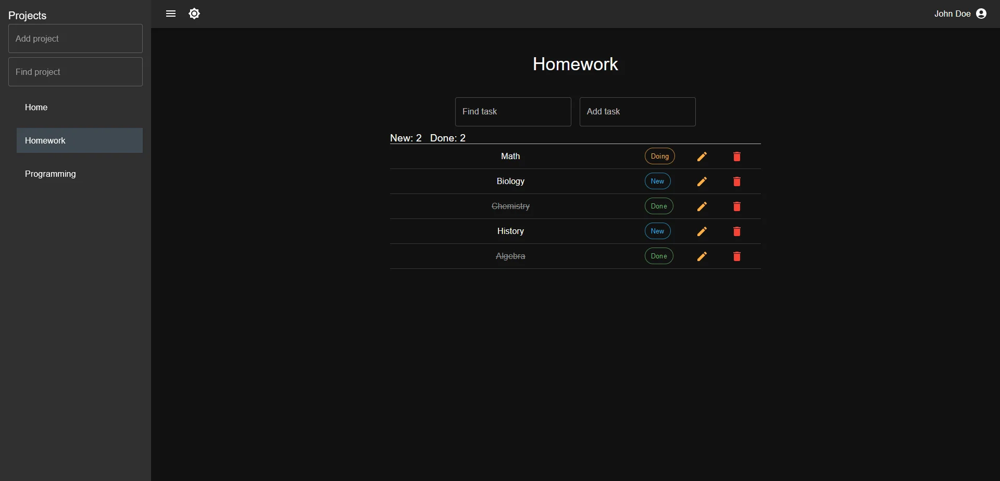
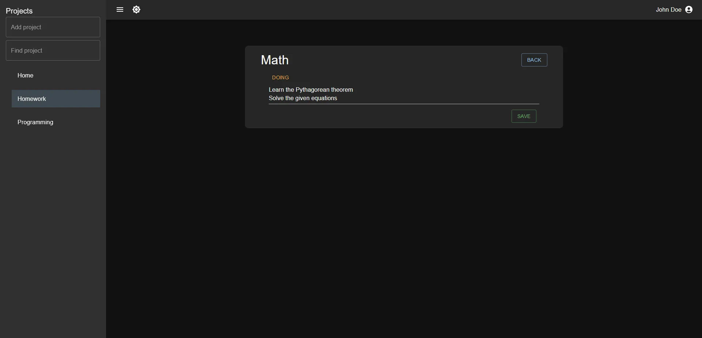

# TaskClimb-FullStack

## Quick Start

```shell
git clone https://github.com/IuanPR/TaskClimb-FullStack.git
```

### _Open each folder in apps/ and install dependencies as well for the root folder_

Then in the root folder enter

```shell
npm run dev
```

### Swagger

You can open swagger ui after ```npm run dev```

```
http://localhost:4580/swagger
```

### Server

Server side was built using Nest and "npm" package manager

> For using TaskClimb-FullStack must to install **_Docker_**

- Backend: [Nest](https://nestjs.com/)
- ORM: [Prisma](https://www.prisma.io/)
- DataBase: [PostgreSQL](https://www.postgresql.org/)
- [Docker](https://www.docker.com/)

### Client

Client side was built using React(Vite) and "npm" package manager

- Client: [React](https://ru.legacy.reactjs.org/)

## Screenshots

Project page


Task page


### For errors

Uncaught Error: Cannot find module 'react'

```shell
$ npm install --save react react-dom @types/react @types/react-dom
```

If he writes that he doesn’t know “turbo”, then write this

```shell
$ npm i turbo
```

## License

TaskClimb-FullStack MIT Licensed
